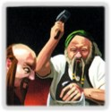

## 
 Draw

### Draw Quality

Almost anything that can increase your handsize. I think I've excluded virtual draw like Cargo Ship, and also Trickster.
Cantrips of course don't draw.
The three categories had the following distinctions in mind:

1. Stuff that draws you once in a while or is just kinda weak, e.g. Settlers/BV, Ride, Summon and the likes. Capital City and Way of the Cameleon can also draw given things that generate $. Also, the weaker Moat-like things are in this category, as they require a good Village to be viable.
2. Lab- and Smithy-like things.
3. Very few things that draw a lot just on their own, e.g. Hunting Grounds, Council Room, or Scrying Pool.

### Draw types

I have tried to provide the different archetypes, marking the ones that are somewhat deviating from the normal one with a \*, and some that do even more with a +.

- **Moat**: Any Moat-like draw that gives you + 2 Cards without providing an Action (e.g. Courtyard, Way of the Squirrel or Vault).
- **Lab**: Anything that lets you increase your handsize non-terminally, akin to Laboratory. Stuff like Sea Chart, Will-o' Wisp, Wishing Well, Vagrant, Poet and the likes are marked as conditional labs, i.e. **Lab\***.
- **Smithy**: Anything somewhat resembling the OG Smithy in that it draws three or more cards in a terminal way, e.g. Carnival, Werewolf, Council Room.
- **DTX**: Short for Draw-to-X, so cards that will draw up to a certain handsize, like Watchtower, Marquis or Cursed Village.
- **On-trash**: Stuff that draws you cards if you trash it or other stuff, like Apprentice or Maroon.
- **On-gain**: Stuff that draws you cards if you gain it or other stuff, like Cavalry or Garrison.
- **Special**: Stuff I couldn't really put into any other category (e.g. Citadel or Captain might increase handsize with a cantrip available, Crossroads depends on your hand, and Footpad doesn't even draw you cards itself).
