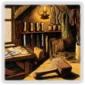

## 
 Extra gains

Being able to gain more than one card/turn is part of what makes games exciting - and there are multiple ways to do so. Straight up extra buys are the most obvious, directly followed by Workshop and Remodel variants.
Also, there are many cards that are highly restrictive on what they allow you to gain (e.g. Bandit) which are included here as well.

### Gain Quality

The three quality values had the following distinctions in mind:

1. Stuff that does somehow allow you to gain multiple cards/turn, but does so very sparingly or highly restrictively. They are usually much much worse than the stuff in the other categories. Also, some Remodel variants are in here that technically don't increase the size of your deck.
2. Anything that allows for +Buy (even Herbalist) or is a normal Workshop variant can be found here.
3. The subjectively strongest of the gainers of category 2, e.g. Groom, Ironworks, Silk Merchant, or Stonemason.

### Gain Types

As mentioned above, one can distinguish between four basic gainer archetypes.
I have decided to label each gainer with one or multiple of the following categories:

- **Buys**: Provides +Buy for an extra gain in some way (not included are events like Bury that state +1 Buy but don't gain anything). CSOs that only provide Buys in a conditional way or a way that requires a trash (such as Animal Fair, or Salvager/Forager) are marked as **Buys\***.
- **Specific**: The gain is restricted to a single card or a single class of cards, e.g. Procession (only Actions), Hoard (Gold only). An asterisk indicates some condition to be met.
- **Workshop**: Resembles a Workshop-like behaviour in that it can gain you any card up to $4 (else it's also labelled as 'specific'). Cards that allow to gain cards at $>\$4$ (e.g. Artisan) are marked as **Workshop+**, cards that are conditional Workshops as **Workshop\*** (e.g. Sunken Treasure).
- **Remodel**: Stuff that trashes other stuff or itself in order to gain stuff. An asterisk denotes further complications, such as Mine's restriction to only remodel treasures.
- **Haggling**: Stuff that gains you cheaper stuff on-buy or on-gain.
- **Extra-turn**: CSOs that give you an extra turn such as Outpost (without requiring a buy, so Journey and Mission are not listed here).
- **Loot**: Gains you Loot. If the card itself gives buys, then that's also indicated (e.g. Jewelled Egg), and otherwise, I indicate **Buys\*** (e.g. Search or Wealthy Village).
- **Boons**: Stuff that provides extra gains via Boons.
- **Horses**: Gains you Horses.
