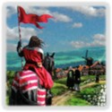
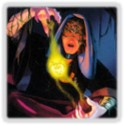

# Quality assignments

This document briefly explains my thoughts behind the different qualities I have assigned to all Card-Shaped Objects (CSOs, these include cards and landscapes).

In short, I have devised them such that one can just add them up (see the very bottom for an explanation) for a given kingdom, to quickly be able to assert whether a certain quality is missing, or super strong.

I therefore needed to rank cards individually, and I limited myself to 3 different levels of strengths (4 if you count a non-existent one) for each card (or landscape) and quality, where 1 resembles a weak trait of the object, 2 corresponds to it being solid, and 3 is only awarded for the strongest and centralizing stuff.

The qualities I provide are the following (click on them to jump to the sections explaining them in detail):

- [Village](#village-quality)
- [Draw](#draw-quality)
- [Thinning](#thinning-quality)
- [Extra Gains](#gain-quality)
- [Attacks](#attack-quality)
- [Alt-VP](#altvp-quality)
- [Interactivity](#interactivity-quality)

This selection should, after the qualities of all CSOs in a kingdom are combined, give an idea of how viable it is in a given kingdom to build an engine.

## 
 Village

### Village Quality

Villages are a heated target of debate [citation needed], but here I've decided to try to include everything that might enable to play you more than one terminal a turn.
The three different categories had the following distinctions in mind:

1. Bad Villages that barely deserve this name due to their one-shot nature (e.g. Necropolis) or are usually finicky to set up, such as Sauna/Avanto, Scepter or Prince.
2. Solid Villages that usually say +2 Actions, and most Throne variants
3. Incredible Villages that can make it so you almost won't need to think about Actions for the rest of the game (e.g. Champion), and also strong villages like Ports or Recruiter.

### Village Types

I've tried to provide Village types that might give you an idea what kind of Village a kingdom offers, which might be useful for assessing the accompanying draw types (e.g. a Handsize-decreasing Village + Moat-like draw will struggle to properly increase handsize).\
Villages that only barely fit the description, or are somewhat conditional have their type marked with a \*.

- **Handsize-neutral**: Anything resembling the basic *Village* archetype of the Base game. This includes Lost-City-like villages, even though they increase your handsize. Maybe I need a better name, go figure.
- **Handsize-decreasing**: Anything providing extra Actions while decreasing your handsize like Necropolis, Festival, or Conclave.
- **Villagers**: Anything providing Villagers.
- **On-gain**: Anything that will only provide a village effect if you gain a card (sometimes the card itself), like Academy, Band of Nomads, or Trail.
- **Throne**: Throne Room variants.
- **For-buy**: This only includes March, Prepare and Delay I believe; I just wanted to indicate that the Village effect is more or less useless without +Buy for those.
- **Single**: Anything that will at max provide one extra action per turn, e.g. Necropolis or Barracks.
- **Special**: Stuff that provides the Village effect in other surprising ways, e.g. Trail's on-trash, or League of Shopkeepers (which sometimes doesn't provide the effect at all).

## 
 Draw

### Draw Quality

Almost anything that can increase your handsize. I think I've excluded virtual draw like Cargo Ship, and also Trickster.
Cantrips of course don't draw.
The three categories had the following distinctions in mind:

1. Stuff that draws you once in a while or is just kinda weak, e.g. Settlers/BV, Ride, Summon and the likes. Capital City and Way of the Cameleon can also draw given things that generate $. Also, the weaker Moat-like things are in this category, as they require a good Village to be viable.
2. Lab- and Smithy-like things.
3. Very few things that draw a lot just on their own, e.g. Hunting Grounds, Council Room, or Scrying Pool.

### Draw types

I have tried to provide the different archetypes, marking the ones that are somewhat deviating from the normal one with a \*, and some that do even more with a +.

- **Moat**: Any Moat-like draw that gives you + 2 Cards without providing an Action (e.g. Courtyard, Way of the Squirrel or Vault).
- **Lab**: Anything that lets you increase your handsize non-terminally. Stuff like Sea Chart, Will-o' Wisp, Wishing Well, Vagrant and the likes are marked as conditional labs, i.e. **Lab\***.
- **Smithy**: Anything somewhat resembling the OG Smithy in that it draws three or more cards in a terminal way, e.g. Carnival, Werewolf, Council Room.
- **DTX**: Short for Draw-to-X, so cards that will draw up to a certain handsize, like Watchtower, Marquis or Cursed Village.
- **On-trash**: Stuff that draws you cards if you trash it or other stuff, like Apprentice or Maroon.
- **On-gain**: Stuff that draws you cards if you gain it or other stuff, like Cavalry or Garrison.
- **Special**: Stuff I couldn't really put into any other category (e.g. Citadel or Captain might increase handsize with a cantrip available, Crossroads depends on your hand, and Footpad doesn't even draw you cards itself).

## 
 Thinning

### Thinning Quality

This quality describes how well a card allows you to thin your deck.\
I am deliberately including exiling here, and also remodelers that just improve the quality of the cards in your deck (e.g. Enhance or even Mine), as well as cards like Ambassador that allow you to return cards from your deck.\
The three quality values had the following distinctions in mind:

1. Weakish thinning stuff that tends to be somewhat niche (at thinning) such as Acolyte, Improve, Enlarge, or Governor.
2. All of the trashers and exilers that can thin one card at a time.
3. Powerful stuff that can get you thin by trashing 2+ cards like Donate, Chapel, Sentry, Peaceful Cult etc.

### Thinning Types

I have assigned one or more of the following thinning types to each of the thinners to be able to distinguish between them and allow for a gauge what kingdoms are able to trash. They include multiple types of information - which types of cards can be thinned, whether some sort of remodelling is possible, and whether the thinner does exile.
For this, I've defined the following categories:

- **Any**: This card (or landscape) can in principle thin any other card (not necessarily itself). Examples are Chapel, Remodel, or Sanctuary.
- **Copper**: Restriction to Copper thinning, e.g. Moneylender or Bonfire.
- **Exile**: The thinning is not actual trashing, but rather exiling. Can be assigned in addition to 'Any'. I have also labelled Island and Miser as Exilers as it's basically the same interaction.
- **Non-Treasure**: Restriction to only thin non-Treasure cards, e.g. Hermit or JoaT.
- **Non-Victory**: Restriction to only thin non-Victory cards, e.g. Enhance.
- **Remodel**: This indicates Remodel variants (gaining a card in exchange for the thinning), e.g. Enlarge, Displace, but also Remake or Upgrade.
- **Remodel\***: This indicates heavily restricted remodel variants that only allow you to gain certain types of cards, such as Jack of All Trades, Mine, or Acolyte.
- **Treasure**: Restriction to thin Treasure cards only, e.g. Spice Merchant.
- **Victory**: Restriction to thin Victory cards only, e.g. Acolyte.

## 
 Alternate paths to victory

### AltVP Quality

Having alternative ways to score is fun! I've tried to capture each cards' or landscapes' ability to do so in this category.
The three categories had the following distinctions in mind:

1. Stuff that does somehow affect scoring but only mildly succeeds in that. Most Cursers are in here as well, and also stuff that might reduce the opponent's VP by trashing their Victory Cards (e.g. Swindler, Saboteur, Knights). Also, rather weak Alt-VP (e.g. Mill) that can supplement some points, but usually doesn't tip the scales.
2. Moderate things that might sometimes incentivize you to build a little bigger or enable alternate strategies, but sometimes also just are welcoming additional VP such as Gardens, Feodom, Labyrinth, Tomb, Fountain, or Monument.
3. Centralizing stuff that might burn you badly if you ignore it, e.g. Collection, Keep

## 
 Extra gains

### Gain Quality

Being able to gain more than one card/turn is part of what makes games exciting - and there are multiple ways to do so. Straight up extra buys are the most obvious, directly followed by Workshop and Remodel variants.
Also, there are many cards that are highly restrictive on what they allow you to gain (e.g. Bandit) which are included here as well.
The three categories had the following distinctions in mind:

1. Stuff that does somehow allow you to gain multiple cards/turn, but does so very sparingly or highly restrictively. They are usually much much worse than the stuff in the other categories. Also, some Remodel variants are in here that technically don't increase the size of your deck.
2. Anything that allows for +Buy (even Herbalist) or is a normal Workshop variant can be found here.
3. The subjectively strongest of the gainers of category 2, e.g. Groom, Ironworks, Silk Merchant, or Stonemason.

### Gain Types

As mentioned above, one can distinguish between four basic gainer archetypes.
I have decided to label each gainer with one or multiple of the following categories:

- **Buys**: Provides +Buy for an extra gain in some way (not included are events like Bury that state +1 Buy but don't gain anything). CSOs that only provide Buys in a conditional way or a way that requires a trash (such as Animal Fair, or Salvager/Forager) are marked as **Buys\***.
- **Specific**: The gain is restricted to a single card or a single class of cards, e.g. Procession (only Actions), Hoard (Gold only). An asterisk indicates some condition to be met.
- **Workshop**: Resembles a Workshop-like behaviour in that it can gain you any card up to $4 (else it's also labelled as 'specific'). Cards that allow to gain cards at $>\$4$ (e.g. Artisan) are marked as **Workshop+**, cards that are conditional Workshops as **Workshop\*** (e.g. Sunken Treasure).
- **Remodel**: Stuff that trashes other stuff or itself in order to gain stuff. An asterisk denotes further complications, such as Mine's restriction to only remodel treasures.
- **Haggling**: Stuff that gains you cheaper stuff on-buy or on-gain.
- **Extra-turn**: CSOs that give you an extra turn such as Outpost (without requiring a buy, so Journey and Mission are not listed here).
- **Loot**: Gains you Loot. If the card itself gives buys, then that's also indicated (e.g. Jewelled Egg), and otherwise, I indicate **Buys\*** (e.g. Search or Wealthy Village).
- **Boons**: Stuff that provides extra gains via Boons.
- **Horses**: Gains you Horses.

## 
 Attacks

### Attack Quality

Basically, any attack will be assigned a quality based on its (clearly subjective) suppressiveness.\
Some cards that do not have the 'Attack' type (like Masquerade, Embargo or Possession) are still labeled as attacks, but assigned the 'indirect' attack type.

### Attack Types

In addition to its strength, each of these attacks os labelled with its AttackType, where I define the following ones:

- **Deck order**: Attacks that dabble with the order of the opponent's deck (such as Rabble, but also Jester or Swindler)
- **Doom**: Since the hexes can be such a mixed bag, I assigned each Doom - Attack only the Doom type (which include basically all of the other types)
- **Handsize**: Militia, Raider and the likes.
- **Indirect**: These are mainly the ones that do not explicitly state the AttackType, but also stuff influencing your decisions like Blockade. Also: Monkey and Shaman as unconventional 'Attacks'
- **Junking**: Looters, Cursers, Copper feeders
- **Scoring**: Everything that might Curse.
- **Trashing**: Stuff that might trash cards from the opponent's deck. Cardinal is also in here, I guess.
- **Turn worsening**: Stuff that will make the opponent's turn worse and didn't really fit any of the other categories (mainly stuff giving out -Card and -Coin tokens)

## 
 Interactivity

### Interactivity Quality

I sometimes try to curate kingdoms that include interactive components apart from the dance around piles and the timing when to green in relation to your opponent.\
Of course all attacks are inherently interactive, but Dominion offers a lot of other player interactions like Artefacts, Gathering-Type cards or split piles. The ranking here is quite random and subjective.
The three categories had the following distinctions in mind:

1. Stuff that can barely be called interactive but is still better than most solitaire cards - here I included obvious once like trash interactions (Graverobber, Lich), Artifacts that aren't that relevant (Swashy), far-stretched stuff like Band of Misfits (depends on the piles you empty if opponents), Landmarks with VP tokens (where timing relative to opponents matters), and most split piles (relying on opponent to uncover stuff?).
2. Basically all attacks and random stuff that felt fairly interactive such as Advisor or Temple or Border Guard.
3. Stuff that really requires an opponent to make sense such as Flagbearer, Family of Inventors, Young Witch (Bane stuff matters), Monkey, but also strong Attacks that might alter the way you play like Clashes, or Shaman.
